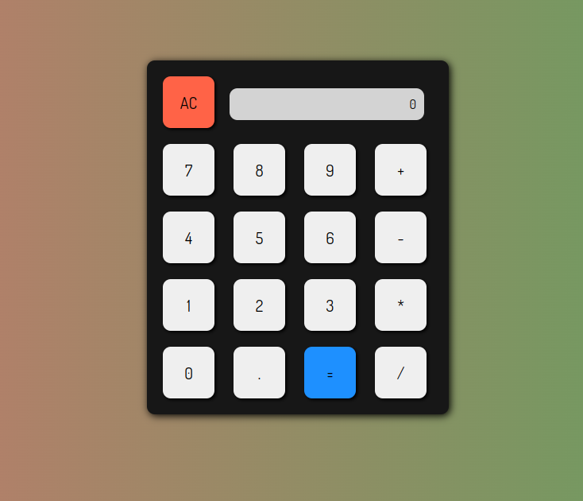

# Simple-Calculator

A simple Calculator for general purposes.

## Why use it?

Its useful for simple calculations.

## Features

* Add
* Multiply
* Subtract
* Divide

## Built With

* html
* css
* javascript

  
## Screenshot

* Hosted Link of calculator

 https://agiratech-musabbir.github.io/Calculator3/

#
